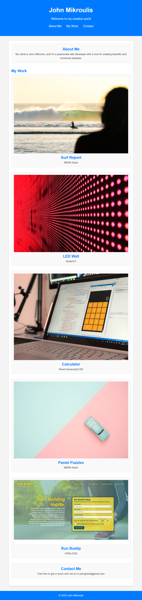

# Portfolio Project

This is my portfolio website showcasing my projects and skills. It's designed to meet the needs of hiring managers by providing information about me, my work, and how to contact me. The website is also responsive and adapts to different screen sizes.

## Table of Contents

- [Description](#description)
- [Demo](#demo)
- [Installation](#installation)
- [Usage](#usage)
- [Screenshots](#screenshots)
- [Contributing](#contributing)
- [License](#license)

## Description

This portfolio website serves as an online resume, showcasing my skills, projects, and providing an easy way to get in touch.

## Demo

You can see a live demo of the portfolio [here](https://johngreek23.github.io/Challenge-2/).

## Installation

To run this project locally, follow these steps:

1. Clone the repository: `git clone https://github.com/your-username/Challenge-2`
2. Navigate to the project directory: `cd Challenge-2`
3. Open `index.html` in your web browser.

## Usage

Navigate through the website using the navigation links. Click on projects to learn more about them, and click the "Contact Me" section to find out how to get in touch.

## Screenshots

The following image shows the web application:

## Contributing

Contributions are welcome! Feel free to open an issue or submit a pull request.

## License

This project is licensed under the MIT License - see the [LICENSE.md](LICENSE.md) file for details.
